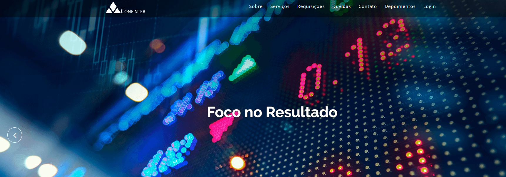

# 🕹 Criação do Projeto Integrador PI - III UNIVESP
> Criação do Projeto Integrador PI - III UNIVESP - 

## 📋 Índice
- [Link do projeto:](http://confinter.rf.gd/)
- [Link do site hospedado:](http://www.confinter.com.br/)
- [📖 Sobre](#-Sobre)
- [🚀 Tecnologias utilizadas](#-Tecnologias-utilizadas)
- [🖥 Preview](#-Preview)
- [📌 Créditos](#-Créditos)

## 📖 Sobre
 - Criação do Projeto Integrador PI UNIVESP

## 🚀 Tecnologias utilizadas
- `PHP`
- `HTML`
- `CSS`
- `Javascript`
- `MSQL`
- `API de Localização – Google Maps Embed API`  
- `Framework - Bootstrap`
- `GitHub`
- `SQL`
- `MySQL Workbench`
- `Visual Studio Code`
- `dash.infinityfree.com`
## 🖥 Preview:

  

   

